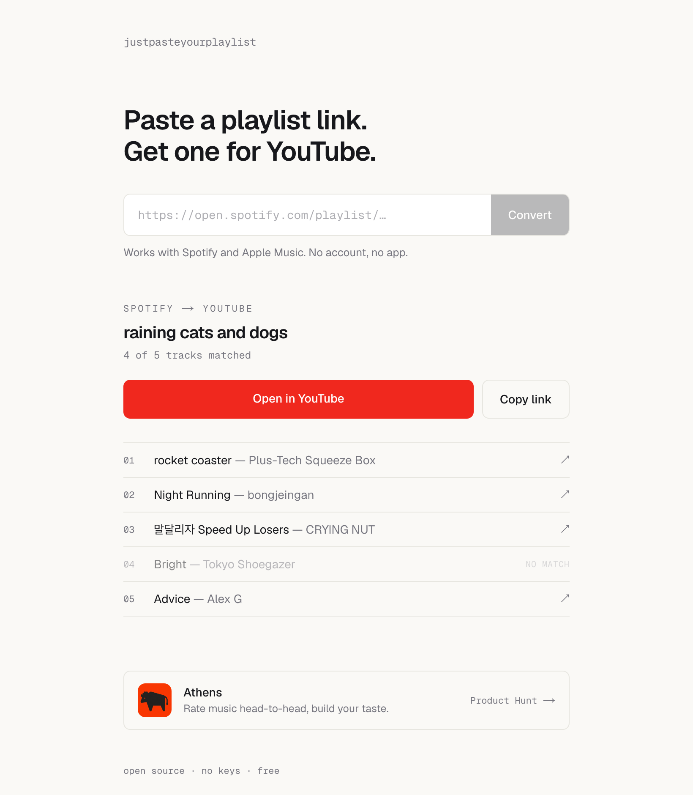

<div align="center">


# Just Paste Your Playlist

**Paste a Spotify or Apple Music playlist link → get a shareable YouTube playlist.**

Free · No sign-up · No API keys · Open source

**[Live Demo](https://justpasteyourplaylist.vercel.app)** · [How it works](#-how-it-works) · [Quick start](#-quick-start) · [Contributing](#-contributing)

<a href="https://www.producthunt.com/products/just-paste-your-playlist?embed=true&utm_source=badge-featured&utm_medium=badge&utm_campaign=badge-just-paste-your-playlist" target="_blank" rel="noopener noreferrer"></a>

<br />



</div>

---

## ✨ Why

Your friends shouldn't need a subscription to hear your playlist. You're on Spotify, they're on Apple Music, someone's mom only opens YouTube. **YouTube is the one platform everyone can access for free** — so this bridges the gap.

Paste a link, get a YouTube playlist, share it with anyone. That's the whole idea.

## 🚀 How It Works

|||
|---|---|
| **1. Paste** | Drop a Spotify or Apple Music playlist URL |
| **2. Convert** | Every track is matched on YouTube automatically |
| **3. Share** | Get one YouTube link with all your songs |

No login. No app install. No waiting.

## 🎧 Supported Sources

```
Spotify        →  ✅  open.spotify.com/playlist/…
Apple Music    →  ✅  music.apple.com/…/playlist/…
                  ↳  YouTube playlist, ready to share
```

## ⚡ Quick Start

No API keys needed — clone and run.

```bash
git clone https://github.com/junnnnnw00/justpasteyourplaylist.git
cd justpasteyourplaylist
npm install
npm run dev
```

Open **[localhost:3000](http://localhost:3000)**. That's it.

## 🛠 Tech Stack

| Layer | Technology |
|-------|-----------|
| Framework | Next.js 16 (App Router) |
| Language | TypeScript (strict) |
| Styling | Tailwind CSS 4 |
| Spotify | Embed page parsing — *no API key* |
| Apple Music | Public page parsing — *no API key* |
| YouTube | `youtube-sr` scraping — *no API key* |
| Hosting | Vercel |

## 🧭 Roadmap

The site is live and open — contributions ship to real users. Pick anything below.

<details>
<summary><strong>🎵 Platform support</strong></summary>

- [ ] Tidal
- [ ] Amazon Music
- [ ] SoundCloud
- [ ] Deezer

</details>

<details>
<summary><strong>⚙️ Core features</strong></summary>

- [ ] Track-by-track progress indicator during conversion
- [ ] Playlist caching — skip re-searching matched tracks
- [ ] Smarter YouTube matching (title similarity scoring)
- [ ] Stream large playlists (500+ tracks) gracefully

</details>

<details>
<summary><strong>🎨 UX</strong></summary>

- [ ] Dark / light mode toggle
- [ ] Mobile-responsive polish
- [ ] Copy individual YouTube links per track
- [ ] Drag-and-drop reorder before generating
- [ ] Native share button
- [ ] Playlist preview with album art

</details>

<details>
<summary><strong>🛡 Reliability & infra</strong></summary>

- [ ] More robust Apple Music extraction
- [ ] Fallback search when `youtube-sr` fails
- [ ] Rate limiting
- [ ] Error tracking / monitoring
- [ ] Tests (URL parsing units, API integration)
- [ ] CI/CD with GitHub Actions

</details>

## 🤝 Contributing

PRs welcome. Keep it simple — a few principles:

- **Single purpose.** Every feature serves the core flow: *paste → convert → share*.
- **No accounts, no keys.** Scraping only. No developer accounts, no quotas, no costs.
- **TypeScript, strictly typed.**
- **Run `npm run build` before opening a PR.**

```bash
npm run dev      # local development
npm run build    # production build + type check
npm run lint     # lint
```

### Project Structure

```
src/
├── app/
│   ├── page.tsx              # UI — paste input, results
│   ├── layout.tsx            # Metadata, OG tags
│   └── api/convert/route.ts  # POST /api/convert — orchestration
└── lib/
    ├── spotify.ts            # Spotify embed parsing
    ├── apple-music.ts        # Apple Music page parsing
    ├── youtube.ts            # youtube-sr search (no API key)
    └── types.ts              # Shared types
```

## 📄 License

[MIT](LICENSE) — do whatever you want.

<div align="center">
<br />
<sub>Built by <a href="https://github.com/junnnnnw00">@junnnnnw00</a> · Also building <a href="https://www.producthunt.com/products/athens">Athens</a>, a music-rating app.</sub>
</div>
